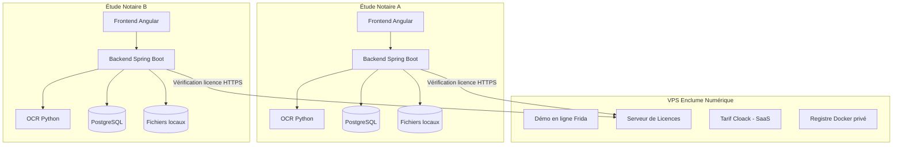

# Architecture SaaS Frida — Installation locale + Licences en ligne

## Décision architecturale

**Frida est un logiciel installé localement** chez chaque étude notariale. Aucun document d'identité ne transite ni ne réside en ligne. Seul un serveur central léger gère les licences et les mises à jour.

---

## Vue d'ensemble



---

## Rôles et responsabilités

### Chez le notaire (installation locale)

| Composant | Rôle | Technologie |
|---|---|---|
| **Frontend** | Interface utilisateur | Angular, Nginx |
| **Backend** | Logique métier, calculs d'héritage | Spring Boot, Java 21 |
| **OCR** | Lecture des documents (QR codes, extraits) | Python, EasyOCR/pyzbar |
| **Base de données** | Stockage des fiches Frida, héritiers, calculs | PostgreSQL |
| **Fichiers** | Scans originaux (PDF, images) | Système de fichiers local |

> [!IMPORTANT]
> **Aucune donnée sensible ne quitte la machine du notaire.** Les documents d'identité, les extraits de naissance et les données personnelles restent strictement en local.

### Sur le VPS (serveur central)

| Composant | Rôle | Priorité |
|---|---|---|
| **Démo Frida** | Version en ligne pour démonstration commerciale | ✅ Existe déjà |
| **Tarif Cloack** | SaaS indépendant, cohabite sur le même VPS | ✅ Existe déjà |
| **Serveur de licences** | Vérification des clés, activation, expiration | 🔜 À construire |
| **Registre Docker** | Distribution sécurisée des mises à jour | 🔜 À construire |
| **Portail éditeur** | Dashboard pour gérer les clients et licences | 🔜 À construire |

---

## Le déploiement VPS actuel (docker-compose.prod.yml)

> [!NOTE]
> Le déploiement VPS **n'est pas obsolète**. Son rôle évolue :

| Avant | Maintenant |
|---|---|
| Production pour tous les utilisateurs | **Démo en ligne** pour montrer le produit aux prospects |
| Stockage centralisé des documents | Aucun stockage de documents client |
| Unique point d'accès | Vitrine + serveur de licences |

Le `docker-compose.prod.yml` reste utile pour :
- La **démo en ligne** sur `frida.enclume-numerique.com`
- Le **développement/staging** avant de distribuer aux testeurs
- Le futur **serveur de licences**

---

## Plan de distribution Beta — Notaires testeurs

### Prérequis pour le notaire

- **Windows 10/11** (64 bits)
- **Docker Desktop** installé ([téléchargement](https://www.docker.com/products/docker-desktop/))
- **8 Go de RAM** minimum (16 Go recommandé pour l'OCR)
- **10 Go d'espace disque** libre

### Ce qu'on livre au testeur

```
frida-install/
├── docker-compose.local.yml     # Compose simplifié (sans Traefik, en localhost)
├── .env                          # Configuration pré-remplie
├── installer.bat                 # Double-clic pour installer (Windows)
├── desinstaller.bat              # Double-clic pour désinstaller
└── README.txt                    # Instructions en français, simples
```

### docker-compose.local.yml (simplifié)

Différences avec la version VPS (`prod`) :

| Aspect | Version VPS (prod) | Version locale |
|---|---|---|
| **Proxy** | Traefik + SSL Let's Encrypt | Aucun (accès direct localhost) |
| **Accès** | `https://frida.enclume-numerique.com` | `http://localhost:4200` |
| **Réseau** | webproxy + internal | Réseau Docker simple |
| **Volumes** | Docker volumes nommés | Dossier local `./data/` |
| **Certificats** | Automatiques (Let's Encrypt) | Aucun (HTTP local) |
| **Mode démo** | Activé | Désactivé |

### Script d'installation (installer.bat)

Le notaire :
1. Installe Docker Desktop (une seule fois)
2. Double-clique sur `installer.bat`
3. Attend ~5 minutes (téléchargement des images)
4. Ouvre `http://localhost:4200` dans son navigateur

C'est tout. Aucune ligne de commande, aucune configuration.

### Distribution des images Docker

**Phase beta (immédiate)** : Images buildées localement via `docker compose build`
- On envoie un `.zip` contenant le code source + le docker-compose
- Le testeur build les images lui-même (transparent via le script)

**Phase production (future)** : Images pré-buildées sur un registre privé
- Registre Docker privé sur le VPS (ou GitHub Container Registry)
- Le testeur fait un `docker compose pull` — pas de build local
- Plus rapide, plus propre, permet les mises à jour automatiques

---

## Roadmap d'implémentation

### Phase 1 — Distribution Beta (priorité immédiate)
- [ ] Créer `docker-compose.local.yml` (sans Traefik, localhost)
- [ ] Créer `installer.bat` et `desinstaller.bat` pour Windows
- [ ] Créer le fichier `.env.example` avec valeurs par défaut
- [ ] Créer le `README.txt` d'installation (français, simple)
- [ ] Tester l'installation complète sur une machine Windows vierge
- [ ] Envoyer le premier .zip aux notaires testeurs

### Phase 2 — Stabilisation fonctionnelle
- [ ] Corriger les bugs remontés par les testeurs
- [ ] Finaliser le parcours complet : création → upload → OCR → calcul → résultat
- [ ] Améliorer la gestion d'erreurs et les messages utilisateur

### Phase 3 — Système de licences
- [ ] Concevoir le modèle de licence (clé unique par étude, durée, renouvellement)
- [ ] Ajouter un filtre de vérification de licence au backend
- [ ] Créer l'API de licences sur le VPS
- [ ] Créer le portail éditeur (gestion des clés, tableau de bord)

### Phase 4 — Mises à jour automatiques
- [ ] Mettre en place un registre Docker privé
- [ ] Créer un mécanisme de mise à jour en un clic (ou automatique)
- [ ] Versionner les releases proprement (tags Git + images Docker)

### Phase 5 — Portail éditeur complet
- [ ] Dashboard : nombre de clients actifs, licences expirantes
- [ ] Facturation : intégration paiement (Stripe ou autre)
- [ ] Support : système de tickets intégré
- [ ] Portail commun avec Tarif Cloack (optionnel)

---

## Décisions prises

| Question | Décision |
|---|---|
| **Réseau** | Une seule machine par étude (multi-postes à prévoir plus tard) |
| **Sauvegarde** | Intégrée dès la beta (`sauvegarder.bat`) |
| **Format de livraison** | Archive `.zip` |
| **Compatibilité machine** | Script de diagnostic intégré à `installer.bat` |
