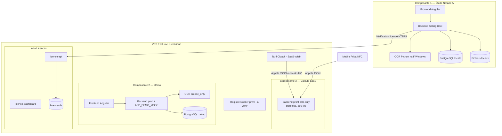

# Architecture SaaS Frida — 3 Composantes

## Décision architecturale

Frida est distribué en **trois composantes** distinctes :

1. **Composante 1 — Local notaire (OCR lourd)** : logiciel complet installé chez chaque étude. Aucun document d'identité ne quitte la machine.
2. **Composante 2 — Démo en ligne** : vitrine commerciale sur le VPS, OCR léger (QR uniquement), aucune donnée client sensible.
3. **Composante 3 — Calculs SaaS** : API JSON pure sur le VPS, stateless, pour appelants machine (Tarif-Cloak, app mobile Frida NFC, intégrations tierces).

Une infrastructure transverse **Licences** (serveur central) valide les clés des installations chez les notaires.

---

## Vue d'ensemble


```mermaid
graph TB
    subgraph notaire1["Composante 1 — Étude Notaire A"]
        F1[Frontend Angular]
        B1[Backend Spring Boot]
        O1[OCR Python natif Windows]
        DB1[(PostgreSQL locale)]
        FS1[(Fichiers locaux)]
        F1 --> B1
        B1 --> O1
        B1 --> DB1
        B1 --> FS1
    end

    subgraph vps["VPS Enclume Numérique"]
        subgraph c2["Composante 2 — Démo"]
            DEMO_F[Frontend Angular]
            DEMO_B[Backend prod + APP_DEMO_MODE]
            DEMO_OCR[OCR qrcode_only]
            DEMO_DB[(PostgreSQL démo)]
            DEMO_F --> DEMO_B
            DEMO_B --> DEMO_OCR
            DEMO_B --> DEMO_DB
        end

        subgraph c3["Composante 3 — Calculs SaaS"]
            CALC[Backend profil calc-only<br/>stateless, 260 Mo]
        end

        subgraph licinfra["Infra Licences"]
            LIC_API[license-api]
            LIC_DASH[license-dashboard]
            LIC_DB[(license-db)]
            LIC_API --> LIC_DB
        end

        TC[Tarif Cloack - SaaS voisin]
        REG[Registre Docker privé - à venir]
    end

    B1 -- "Vérification licence HTTPS" --> LIC_API
    TC -- "Appels JSON /api/calculs/*" --> CALC
    MOBILE[Mobile Frida NFC] -- "Appels JSON" --> CALC
```

Domaines :
- `frida.enclume-numerique.com`, `simul-frida.enclume-numerique.com` → Composante 2
- `calc.frida.enclume-numerique.com` → Composante 3
- `licences.frida.enclume-numerique.com` → Infra Licences

---

## Rôles et responsabilités

### Chez le notaire (installation locale)

| Composant | Rôle | Technologie |
|---|---|---|
| **Frontend** | Interface utilisateur | Angular, Nginx |
| **Backend** | Logique métier, calculs d'héritage | Spring Boot, Java 21 |
| **OCR** | Lecture des documents (QR codes, extraits) | Python, EasyOCR/pyzbar |
| **Base de données** | Stockage des fiches Frida, héritiers, calculs | PostgreSQL |
| **Fichiers** | Scans originaux (PDF, images) | Système de fichiers local |

> [!IMPORTANT]
> **Aucune donnée sensible ne quitte la machine du notaire.** Les documents d'identité, les extraits de naissance et les données personnelles restent strictement en local.

### Sur le VPS (serveur central)

| Composant | Compose file | Rôle | État |
|---|---|---|---|
| **Composante 2 — Démo Frida** | `compose/vps.demo.yml` | Vitrine commerciale (`frida.enclume-numerique.com`, `simul-frida.enclume-numerique.com`) | ✅ En prod |
| **Composante 3 — Calculs SaaS** | `compose/vps.calc.yml` | API JSON pure sur `calc.frida.enclume-numerique.com` pour appelants machine | ✅ En prod |
| **Infra Licences** | `compose/vps.licences.yml` | Vérification des clés, dashboard admin sur `licences.frida.enclume-numerique.com` | ✅ En prod |
| **Tarif Cloack** | (repo séparé) | SaaS indépendant, cohabite sur le même VPS | ✅ Existe déjà |
| **Registre Docker privé** | — | Distribution sécurisée des mises à jour | 🔜 À construire |

---

## Le déploiement VPS actuel

Le déploiement s'appuie sur **trois stacks compose indépendants** (voir `compose/README.md`), reliés par le réseau Traefik `webproxy` :

```bash
docker compose -f compose/vps.demo.yml up -d       # Composante 2
docker compose -f compose/vps.calc.yml up -d       # Composante 3
docker compose -f compose/vps.licences.yml up -d   # Infra licences
```

Chaque stack peut être redéployé indépendamment (le rebuild de la démo ne touche pas au serveur de licences ni à l'API calc).

---

## Plan de distribution Beta — Notaires testeurs

### Prérequis pour le notaire

- **Windows 10/11** (64 bits)
- **WSL2 + Ubuntu** (installé automatiquement par le script — pas de Docker Desktop)
- **8 Go de RAM** minimum (16 Go recommandé pour l'OCR)
- **10 Go d'espace disque** libre

### Ce qu'on livre au testeur

```
install-notaire/wsl-installation/
├── Installer-WSL.bat               # Double-clic pour installer (Windows)
├── Installer-WSL.ps1               # Script PowerShell appelé par le .bat
└── frida-micros.zip                # Sources backend + frontend

install-notaire/docker-installation/
├── docker-compose.local.yml        # Compose de la Composante 1 (sans Traefik)
├── Installer-Docker.bat            # Setup Docker à l'intérieur de WSL
├── desinstaller.bat                # Double-clic pour désinstaller
├── sauvegarder.bat                 # Backup PostgreSQL + uploads
└── LISEZMOI.txt                    # Instructions en français
```

### docker-compose.local.yml (simplifié)

Différences avec la version VPS (`prod`) :

| Aspect | Version VPS (prod) | Version locale |
|---|---|---|
| **Proxy** | Traefik + SSL Let's Encrypt | Aucun (accès direct localhost) |
| **Accès** | `https://frida.enclume-numerique.com` | `http://localhost:4200` |
| **Réseau** | webproxy + internal | Réseau Docker simple |
| **Volumes** | Docker volumes nommés | Dossier local `./data/` |
| **Certificats** | Automatiques (Let's Encrypt) | Aucun (HTTP local) |
| **Mode démo** | Activé | Désactivé |

### Script d'installation (Installer-WSL.bat)

Le notaire :
1. Double-clique sur `Installer-WSL.bat` (installe WSL Ubuntu si absent, redémarre si nécessaire)
2. Ré-exécute une fois WSL prêt (le script détecte cet état et enchaîne)
3. Attend ~5 minutes (build des images côté WSL)
4. Ouvre `http://localhost:4200` dans son navigateur

C'est tout. Aucune ligne de commande, aucun Docker Desktop, aucune configuration.

### Distribution des images Docker

**Phase beta (immédiate)** : Images buildées localement via `docker compose build`
- On envoie un `.zip` contenant le code source + le docker-compose
- Le testeur build les images lui-même (transparent via le script)

**Phase production (future)** : Images pré-buildées sur un registre privé
- Registre Docker privé sur le VPS (ou GitHub Container Registry)
- Le testeur fait un `docker compose pull` — pas de build local
- Plus rapide, plus propre, permet les mises à jour automatiques

---

## Roadmap d'implémentation

### Phase 1 — Distribution Beta ✅ Fait
- [x] Créer `docker-compose.local.yml` (sans Traefik, localhost)
- [x] Créer les scripts `Installer-WSL.bat` / `desinstaller.bat` pour Windows
- [x] Créer le fichier `.env.example` avec valeurs par défaut
- [x] Créer le `LISEZMOI.txt` d'installation
- [ ] Tester l'installation complète sur une machine Windows vierge (en cours)
- [ ] Envoyer le premier .zip aux notaires testeurs

### Phase 2 — Stabilisation fonctionnelle (en cours)
- [ ] Corriger les bugs remontés par les testeurs
- [ ] Finaliser le parcours complet : création → upload → OCR → calcul → résultat
- [ ] Améliorer la gestion d'erreurs et les messages utilisateur

### Phase 3 — Système de licences ✅ Fait
- [x] Concevoir le modèle de licence (clé unique par étude, durée, renouvellement)
- [x] Ajouter un filtre de vérification de licence au backend (`LicenseInterceptor` + `LicenseValidationService`)
- [x] Créer l'API de licences sur le VPS (`license-api`, `licences.frida.enclume-numerique.com`)
- [x] Créer le portail éditeur (dashboard `license-dashboard`)

### Phase 4 — Composante 3 : Calculs SaaS ✅ Fait
- [x] Extraire un profil Spring `calc-only` (backend stateless sans DB/OCR)
- [x] Guarder les contrôleurs et services non-Calcul avec `@Profile("!calc-only")`
- [x] Créer `compose/vps.calc.yml` + entrée DNS `calc.frida.enclume-numerique.com`
- [x] Page d'accueil JSON sur `/` + gestion propre du 404
- [ ] Documenter l'API publique pour intégrateurs (Swagger déjà exposé, guide d'usage à écrire)

### Phase 5 — Mises à jour automatiques
- [ ] Mettre en place un registre Docker privé
- [ ] Créer un mécanisme de mise à jour en un clic (ou automatique)
- [ ] Versionner les releases proprement (tags Git + images Docker)

### Phase 6 — Portail éditeur complet
- [ ] Dashboard : nombre de clients actifs, licences expirantes
- [ ] Facturation : intégration paiement (Stripe ou autre)
- [ ] Support : système de tickets intégré
- [ ] Portail commun avec Tarif Cloack (optionnel)

---

## Décisions prises

| Question | Décision |
|---|---|
| **Réseau** | Une seule machine par étude (multi-postes à prévoir plus tard) |
| **Sauvegarde** | Intégrée dès la beta (`sauvegarder.bat`) |
| **Format de livraison** | Archive `.zip` |
| **Compatibilité machine** | Script de diagnostic intégré à `installer.bat` |
