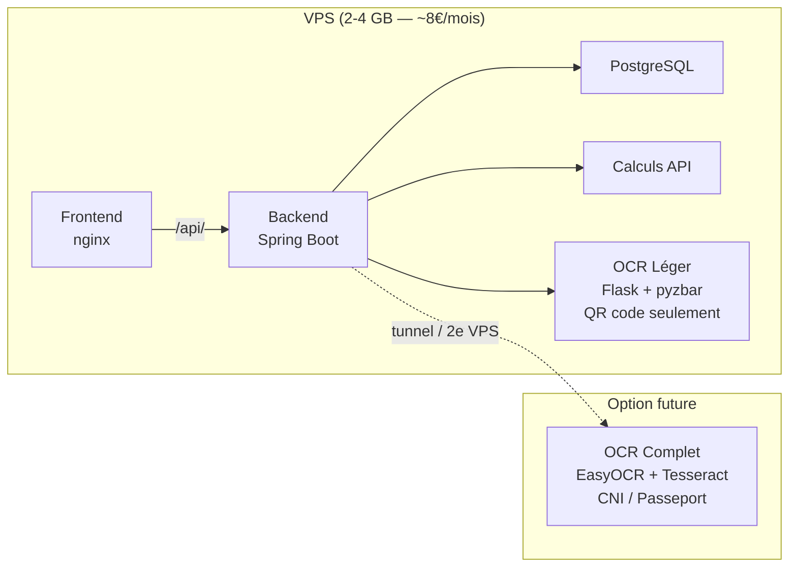
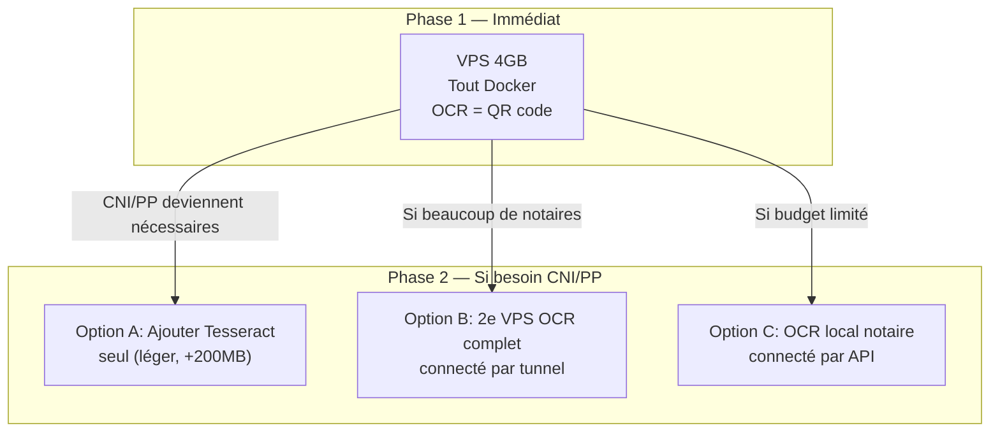

# Stratégie Hybride — OCR Léger pour VPS

## L'idée en résumé

Déployer **tout sur le VPS** mais avec un service OCR **allégé** qui ne fait que la lecture QR code (entité `en_01`). Les CNI/passeports, plus rares et plus lourds, restent en option locale.



## Pourquoi c'est une excellente idée

### 1. Le QR code de l'extrait de naissance contient déjà tout

L'entité `en_01` définit **une seule zone** de type `"qrcode"`. Le QR code de l'extrait de naissance algérien contient les données structurées : nom, prénom, date de naissance, lieu, sexe, etc.

> [!TIP]
> Pas besoin de Tesseract, EasyOCR ou PaddleOCR pour lire un QR code. **pyzbar + OpenCV** suffisent amplement.

### 2. Comparaison des empreintes mémoire

| Composant | OCR Complet | OCR Léger (QR only) |
|-----------|-------------|---------------------|
| Python Flask | 50 MB | 50 MB |
| Tesseract + modèles ara/fra | 200 MB | ❌ Non requis |
| EasyOCR + PyTorch | 1.5-2 GB | ❌ Non requis |
| PaddleOCR | 500 MB | ❌ Non requis |
| pyzbar | 5 MB | 5 MB ✅ |
| OpenCV (headless) | 80 MB | 80 MB |
| Pillow + numpy | 50 MB | 50 MB |
| **Total OCR** | **≈ 2.5-3 GB** | **≈ 200 MB** |

### 3. Coût VPS résultant

| Service | RAM |
|---------|-----|
| PostgreSQL | 256 MB |
| Backend Spring Boot | 512 MB |
| Calculs API | 256 MB |
| Frontend nginx | 64 MB |
| **OCR Léger** | **200 MB** |
| OS + Docker | 512 MB |
| **Total** | **≈ 1.8 GB** |

> [!IMPORTANT]
> Un VPS **2 GB** suffit (avec swap), un **4 GB** est confortable.
> - Hetzner CX22: 4 GB, 2 vCPU — **4.35€/mois**
> - Contabo VPS S: 8 GB, 4 vCPU — **6.99€/mois**

---

## Modifications nécessaires

### 1. Créer un Dockerfile OCR allégé

Un nouveau Dockerfile pour le service OCR qui n'installe **ni Tesseract, ni EasyOCR, ni PaddleOCR** :

```dockerfile
# Dockerfile.qrcode — OCR léger (QR code seulement)
FROM python:3.10-slim

# Seulement libzbar (pour pyzbar) et libgl1 (pour OpenCV)
RUN apt-get update && apt-get install -y --no-install-recommends \
    libzbar0 libglib2.0-0 libgl1 curl \
    && rm -rf /var/lib/apt/lists/*

WORKDIR /app

# Copier core_lib et installer
COPY core_lib/ /app/core_lib/
RUN pip install -e /app/core_lib --no-cache-dir

# Copier l'app OCR avec un requirements minimal
COPY app_ocr/ /app/app_ocr/
RUN pip install --no-cache-dir \
    flask flask-cors \
    pyzbar \
    opencv-python-headless \
    Pillow numpy \
    pypdfium2 pdfplumber \
    python-dotenv

WORKDIR /app/app_ocr

ENV PYTHONUNBUFFERED=1
ENV PORT=8082
ENV OCR_MODE=qrcode_only

HEALTHCHECK CMD curl -f http://localhost:${PORT}/api/entites || exit 1
CMD ["python", "run.py"]
```

> [!NOTE]
> **Taille de l'image Docker** : ~300 MB au lieu de ~3 GB pour l'image complète.

### 2. Adapter le service Python (optionnel mais propre)

Le code actuel dans [ocr_engine.py](file:///c:/Users/hamoh/Documents/projets/frida/frida-micros/easytess_ocr_api/backend/app_ocr/app/services/ocr_engine.py) gère déjà gracieusement l'absence de Tesseract/EasyOCR :

```python
# Ligne 708-739 — déjà du lazy detection
TESSERACT_DISPONIBLE = False  # Si pas installé → False
EASYOCR_DISPONIBLE = False    # Si pas installé → False
```

Le QR code est traité par [qrcode_utils.py](file:///c:/Users/hamoh/Documents/projets/frida/frida-micros/easytess_ocr_api/backend/app_ocr/app/utils/qrcode_utils.py) via `decoder_code_hybride()` qui :
1. Essaie **pyzbar** (supporte QR + codes-barres)
2. Fallback sur **OpenCV QRCodeDetector** (si pyzbar absent)

→ Aucune modification du code Python n'est strictement nécessaire ! Juste le Dockerfile change.

### 3. Limiter les entités disponibles

Ne déployer que `en_01.json` (et `en_01_qrcode_01.json`) dans le répertoire `entities/` du container :

```yaml
# docker-compose.prod.yml
services:
  ocr-api:
    build:
      context: ../easytess_ocr_api/backend
      dockerfile: Dockerfile.qrcode
    volumes:
      # Monter seulement les entités QR code
      - ./ocr-entities-qr/:/app/app_ocr/entities/
```

### 4. Adapter le frontend

Côté Angular, l'interface d'upload ne propose que l'option "Extrait de Naissance (QR code)" en mode VPS. Les options CNI/Passeport seraient grisées avec un message "Disponible en mode local".

---

## Architecture évolutive



> [!TIP]
> **Phase 1** est suffisante pour démarrer : chaque héritier fournit obligatoirement un extrait de naissance, et le QR code en extrait toutes les données nécessaires. Le CNI/passeport n'est qu'une pièce complémentaire.

---

## Questions

> [!IMPORTANT]
> 1. **Le QR code de l'EN contient-il le sexe ?** Si oui, c'est parfait — toutes les données nécessaires au calcul sont dans le QR code. Sinon, il faudrait ajouter une saisie manuelle du sexe.
> 2. **Voulez-vous fusionner backend + calculs avant le déploiement ?** Ça économiserait ~256 MB de RAM et simplifierait la config.
> 3. **Quel fournisseur VPS préférez-vous ?** (Hetzner, OVH, Contabo, DigitalOcean...)
